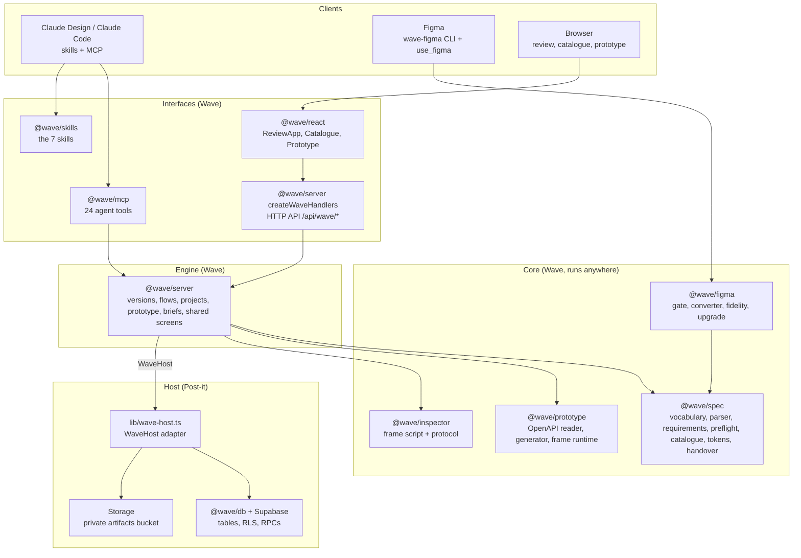
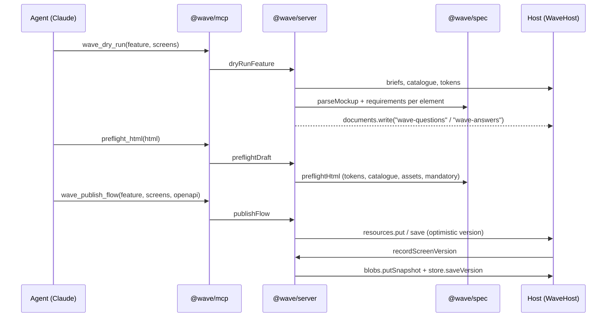
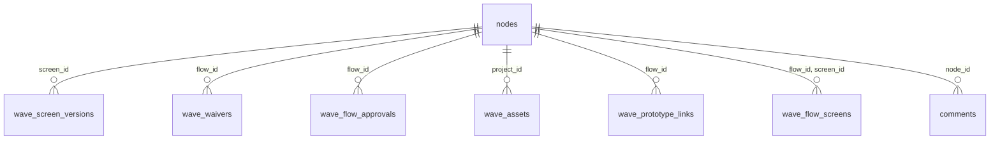
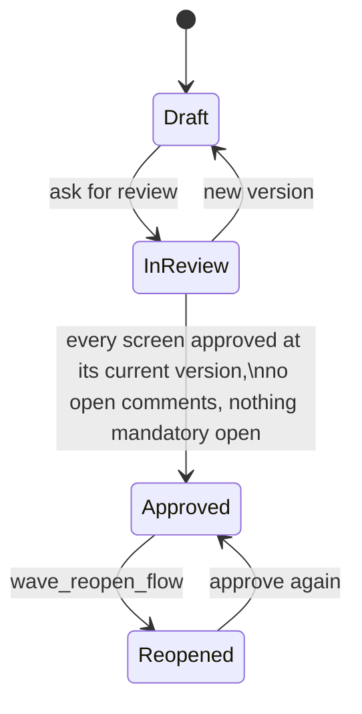

# Architecture

Wave is a set of TypeScript packages, not an app. It has no users, no login and
no file storage of its own: a product that hosts it (the **host**) supplies
identity, permissions, storage and comments through one interface, `WaveHost`.
Post-it is the first host; Lighter is the second.

This page covers the layers, the packages in each, how a page moves through
them, where things are stored, and the security model.

## Layers

| Layer | Packages | Responsibility | Runs in |
| --- | --- | --- | --- |
| Core | `@wave/spec`, `@wave/prototype`, `@wave/inspector`, `@wave/figma` | Pure functions over HTML, briefs, tokens and OpenAPI. No I/O except Figma's renders. | Anywhere (`@wave/spec/client` is the browser-safe subset) |
| Engine | `@wave/server` | Every operation that needs storage: record a version, load a screen, edit, flow overview, approve, handover, prototype, briefs, shared screens. Written only against `WaveHost`. | Server |
| Interfaces | `@wave/mcp`, `@wave/server` (`createWaveHandlers`), `@wave/react`, `@wave/skills` | Agents, HTTP, UI and the skills that guide agents through the work | Server, browser, agents |
| Host | `@wave/db` + the host's adapter | Identity, permissions, files, comments, Wave's tables | The host's server and database |

## Packages

| Package | What it is | Main exports |
| --- | --- | --- |
| `@wave/spec` | The vocabulary (`data-wave-*`, `wave:` meta, `wave-resources`), the parser, element types and the questions engine, preflight, byte-exact HTML edits, DTCG tokens, off-token CSS, the catalogue, flow analysis, briefs, question sheets, ids, assets, handover and zip | `parseMockup`, `detectType`, `requirementsFor`, `preflightHtml`, `assignIds`, `parseSpecimen`, `matchInstances`, `parseTokens`, `validateTokenDocument`, `parseDesignMd`, `parseFeatureMd`, `buildHandover` |
| `@wave/server` | The engine, against `WaveHost` | `recordScreenVersion`, `loadScreenView`, `editScreen`, `flowOverview`, `approveFlow`, `flowHandover`, `projectContext`, `dryRunFeature`, `preflightDraft`, `prototypeOf`, `publishFlow`, `useScreen`, `reopenFlow`, `createWaveHandlers` |
| `@wave/db` | Wave's tables and functions for Postgres (`sql/schema.sql`, `assets.sql`, `shared-screens.sql`), the host contract they call (`sql/host-contract.sql`), and `supabaseWaveStore(db)` | `supabaseWaveStore` |
| `@wave/mcp` | 24 agent tools a host adds to its MCP server | `createWaveTools`, `describeAnchorForAgent`, `fetchAsset` |
| `@wave/react` | The review UI | `ReviewApp`, `Compare`, `FlowOverview`, `CatalogueView`, `Prototype`, `TokenInventory`, `WaveProvider`, `wave.css` |
| `@wave/inspector` | The script injected into a sandboxed mockup frame, and the typed `wave:*` postMessage protocol | `injectInspector`, `readMessage`, `PROTOCOL_VERSION` |
| `@wave/prototype` | Reads a feature's OpenAPI (JSON or YAML) into what the prototype serves, drafts one from screens, writes the data requirements, and the frame runtime (MSW mock server + bindings) | `readApi`, `generateApi`, `injectPrototype`, `PROTOTYPE_SOURCE` |
| `@wave/figma` | The Figma entry gate, Figma's reference code to static HTML, fidelity against Figma's render, semantic upgrade with the look lock, id carry, the `wave-figma` CLI | `inspectNodes`, `evaluateGate`, `convertFigma`, `compareImages`, `applyUpgrade`, `carryIds`, `GATE_RULES` |
| `@wave/skills` | The skills, generated from `@wave/spec` so they ask exactly what the validator checks, with host steps passed in | `waveDesignSkill`, `waveBriefSkill`, `waveDesignSystemSkill`, `waveFeatureSkill`, `waveReviewSkill`, `waveFigmaSkill`, `waveBuildSkill` |
| `@wave/docs` | These docs: the reference pages are generated from the code | `generate.ts` |

## How a screen moves through Wave

1. **Every save, through any door, ends in `recordScreenVersion`.** It snapshots
   the bytes (`blobs.putSnapshot`) and stores an index of what the spec says:
   screen meta, every node, every finding (`store.saveVersion`).
2. **Reading a screen** (`loadScreenView`) parses it, resolves each element's
   questions against the inheritance order, and returns findings, requirements,
   comments with their anchors, the catalogue matches and the assets.
3. **Editing** (`editScreen`) is a byte-exact change to the HTML (confirm,
   change, waive), allowed only to the uploader, at the current version.
4. **A flow's overview** (`flowOverview`) gathers its screens (its own and the
   ones it uses), tokens, blockers, open comments and waivers, and says whether it
   can be approved.
5. **Approval** (`approveFlow`) pins every screen's version and snapshot, the
   tokens and the waivers. The handover and the prototype then play those.

## The inheritance order

The questions engine asks a question only when nothing answers it. In order:

1. The element's own HTML (`data-wave-*`, native attributes).
2. FEATURE.md: fields, data, actions, the screen's route, title and access.
3. Its catalogue component: states, variants, responsive behaviour, events.
4. DESIGN.md: copy, access, analytics, flags, forms, empty values, overflow, icons, viewports, language.
5. What Wave knows for certain: slugs, element types, a submit button's trigger, action names.

## The host contract

A host makes one `WaveHost` per request for the person asking, so every answer
is already filtered to what they may see.

| Member | Required | Gives Wave |
| --- | --- | --- |
| `viewer` | yes | `{ id, label }`, or null when nobody is signed in |
| `resources` | yes | Screens and flows: `screen`, `readCurrent`, `save(id, html, baseVersion)`, `flowOf`, `flow`, `setFlow`, `members`, `canEdit`, `isAuthor`; optional `put` (publish by name) and `extras` |
| `comments` | yes | `list`, `statuses`, optional `setStatus` (the host enforces who may set which status) |
| `blobs` | yes | `putSnapshot`, `read`, `remove`: version snapshots |
| `store` | yes | `WaveStore`, Wave's own tables (`supabaseWaveStore` on Supabase) |
| `projects` | optional | `projectOf`, `project`, `setProject`, `tokens`, `specimens`, `screens`, `componentsFolder` |
| `assets` | optional | `baseUrl`, `put`, `list`, `read`: the project's asset store |
| `documents` | optional | `read`, `write`: DESIGN.md, FEATURE.md, the question and answer sheets |
| `api` | optional | `read`, `write`: a feature's OpenAPI, mocks and data requirements |
| `links` | optional | `screen`, `prototype`: links agents hand out |

Rules the host is trusted with, because Wave never decides them itself:

1. Answer only what `viewer` may see; a screen they cannot read is `null`.
2. `save` refuses when `baseVersion` is not current, and records the version.
3. Only the author marks a comment addressed; somebody else resolves it.
4. Approval is checked again in the database.

The full types are in [[wave/reference/types|Types]] (Host contract).

## Storage

In Post-it, Wave's data lives in Postgres (Supabase) and a private storage bucket.

| Table | Holds | Written by |
| --- | --- | --- |
| `nodes` (Post-it's pages) | Screens (`content_type 'html'`, bytes in an artifact via `artifact_key`), specimens, token files, briefs and sheets (articles), folders marked `is_project` or `is_flow`, per-page review (`review_status`, `review_version`) | The host |
| `wave_screen_versions` | One row per screen version: `snapshot_key`, `screen` (meta), `nodes` (every element), `findings`, `extras`; unique per `(screen_id, content_version)` | `recordScreenVersion` |
| `wave_waivers` | A flow's waived checks: `check_key`, `message`, `note`, `created_by` | `addWaiver`, `removeWaiver` |
| `wave_flow_approvals` | Each approval: pinned `members` (screen, version, snapshot), `tokens`, `waivers`, `reopened_at` | Only the `wave_approve_flow` function |
| `wave_assets` | A project's images and fonts by SHA-256: `hash`, `ext`, `mime`, `bytes`, `name` | `assets.put` |
| `wave_prototype_links` | Share links: only `sha256(token)`, `label`, `expires_at`, `revoked_at` | The host's share tools |
| `wave_flow_screens` | Screens a feature uses from another feature | `useScreen`, `unuseScreen` |
| `comments` | Post-it's comments, with Wave's `anchor`, `status`, `status_note`, `status_version` | The host; status only through `set_comment_status` |

Field-level answers and waivers are written into the HTML itself (`data-wave-*`,
`data-wave-waived`, `wave:waived`), so the page carries its own spec. The
question and answer sheets are ordinary pages ("Wave questions", "Wave answers").

**Files.** Screen bytes, version snapshots and assets are in the private
`artifacts` bucket. Assets are content-addressed: `assets/<project>/<sha256>.<ext>`,
stored once per project, served publicly and immutably at `/a/<project>/<sha256>.<ext>`.
Deleting a page removes its artifacts, its versions' snapshots and, for a project,
its assets.

## Approval and lock

`wave_approve_flow` refuses unless the caller may read the flow and is not its
creator, it has at least one screen, every member is approved at its current
version, no comment is open or addressed, and every screen has a snapshot. It
then pins the members, tokens and waivers. While a feature is locked, saving its
API, publishing and using screens are refused (409); the prototype and the
handover play the pinned versions.

**Shared screens.** A feature can use a screen that lives in another feature of
the same project (`wave_use_screen`). Publishing saves it where it lives, as a
new version; a locked feature keeps the version it approved.

## Security

- **Who changes a screen.** Only its uploader (`isAuthor`), at its current
  version. Everyone else comments. Flow and project changes need edit rights.
- **Row-level security.** Every `wave_*` table checks `wave_can_read` and
  `wave_can_edit`, which map to the host's own `can_read` and `can_edit`.
  Approvals are inserted only by the security-definer function.
- **Agents.** MCP tools run as the person whose token they hold, under the same
  rules.
- **Sandboxed mockups.** Review and prototype frames are served with
  `sandbox allow-scripts allow-popups; frame-ancestors 'self'` (an opaque origin,
  no `allow-same-origin`), `nosniff`, `no-referrer` and `no-store`. Messages from
  a frame come from origin "null" and are treated as untrusted: checked for
  shape, never rendered, able to do only what a click could.
- **Share links.** A prototype link's token is 24 random bytes; only its hash is
  stored, it is shown once, expires in 1 to 365 days and can be revoked. Every
  failure looks the same.
- **Assets.** Only images and fonts, identified by their bytes, up to 10 MB,
  fetched only from allowed hosts over https; served with a locked-down CSP.

## Extending Wave

- **A new host**: implement `WaveHost`, run `@wave/db`'s SQL (or implement
  `WaveStore`), mount `createWaveHandlers`, add `createWaveTools()` to your MCP
  server and publish the skills with your own `HostSteps`. See
  [[wave/hosting|Hosting Wave]].
- **A new element type or question**: `@wave/spec` (`elements.ts`,
  `requirements.ts`); the skills and these reference pages follow.
- **A new design source**: like `@wave/figma`, convert to HTML with
  `data-wave-*` and prove fidelity; Wave itself does not change.
