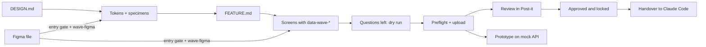

# Wave

**Design that ships as specified.** Wave turns a product design into a spec that
people can review and Claude Code can build without guessing. The design is HTML,
and everything about each element lives on the element itself: what it is, what
it says, what it does, where it goes and what happens when it fails.

## The problem

A mockup shows one moment of a product. Everything else lives in people's heads:
the error a field shows, where a button leads, what a list does when it is
empty, which data fills a label, who may see a section. Engineers fill those
gaps by guessing, reviewers comment on pictures, and the product that ships
drifts from the one that was designed.

## What Wave does

1. **One brief per project, one per feature.** DESIGN.md holds the defaults every
   element inherits: copy, access, analytics, forms, empty values. FEATURE.md
   holds the feature's fields, data and actions. Most questions are answered
   once, here, for every element that uses them.
2. **A design system that is checked, not described.** Tokens in the DTCG format
   and one approved HTML specimen per component, with every variant and state
   drawn. Screens reuse the catalogue exactly; Wave finds drift.
3. **Screens with their meaning on them.** `data-wave-*` attributes on each
   element: identity, content, behaviour, inputs, states. Wave detects each
   element's type and asks only what is still open, grouped, with a proposal.
4. **Review on the real thing.** Screens are reviewed in Post-it with comments
   anchored to elements, not pixels. Only the uploader edits; everyone else
   comments; reviewers approve.
5. **A working prototype.** The whole feature plays in one frame on a mock API
   (OpenAPI + MSW): navigation, validation, loading and failure scenarios.
6. **A handover Claude Code builds from.** Once a feature is approved and
   locked, its screens, catalogue, tokens, assets, API and every decision go to
   Claude Code as one handover.

## Who it is for

| Who | Does |
| --- | --- |
| Designer | Writes the briefs with Claude, designs in Claude Design or Figma, answers the design questions, uploads, plays the prototype |
| Product | Answers the product questions (data, rules, navigation, access, tracking) in the question sheet |
| Reviewer | Comments on elements, confirms or changes Wave's proposals, approves |
| Engineer (with Claude Code) | Builds from the handover with the Wave Build skill |

## Where you meet it

- **Claude Design and Claude Code**, through Wave's skills (Wave Design, Brief,
  Design System, Feature, Review, Figma, Build) and the host's MCP tools.
- **Post-it**, the host: projects, features, review, catalogue, prototype,
  handover. Wave is built to be hosted; Lighter is the second host.
- **Figma**, through the Wave Figma skill and the `wave-figma` command line:
  a file that passes the entry gate is converted exactly as drawn.

## How it fits together

## Read next

- [[wave/user-manual|User manual]]: the whole journey, step by step.
- [[wave/quick-guide|Quick guide for designers]]: the journey on one page.
- [[wave/figma-engineer-guide|Figma to Wave: the engineer's guide]] and its [[wave/figma-quick-guide|quick guide]]: bringing a Figma design into Wave by talking to Claude, stage by stage.
- [[wave/concepts|Concepts]]: the words Wave uses.
- [[wave/architecture|Architecture]]: the layers, the packages and how a page moves through them.
- [[wave/runtime|Runtime]]: the inspector, the prototype runtime and the mock API inside the frame.
- [[wave/hosting|Hosting Wave]]: for engineers putting Wave into a product.
- Reference: [[wave/reference/html-spec|HTML spec]], [[wave/reference/element-types|element types]],
  [[wave/reference/briefs|briefs]], [[wave/reference/http-api|HTTP API]], [[wave/reference/mcp-tools|MCP tools]],
  [[wave/reference/types|types]], [[wave/reference/figma-entry-gate|Figma entry gate]].
- [[wave/roadmap|Roadmap and status]].
