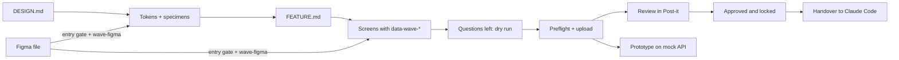

# Wave

**Design that ships as specified.** Wave turns a product design into a spec that
people can review and Claude Code can build without guessing. The design is HTML,
and everything about each element lives on the element itself: what it is, what
it says, what it does, where it goes and what happens when it fails.

## The problem

A mockup shows one moment of a product. Everything else lives in people's heads:
the error a field shows, where a button leads, what a list does when it is
empty, which data fills a label, who may see a section. Engineers fill those
gaps by guessing, reviewers comment on pictures, and the product that ships
drifts from the one that was designed.

## What Wave does

1. **One brief per project, one per feature.** DESIGN.md holds the defaults every
   element inherits: copy, access, analytics, forms, empty values. FEATURE.md
   holds the feature's fields, data and actions. Most questions are answered
   once, here, for every element that uses them.
2. **A design system that is checked, not described.** Tokens in the DTCG format
   and one approved HTML specimen per component, with every variant and state
   drawn. Screens reuse the catalogue exactly; Wave finds drift.
3. **Screens with their meaning on them.** `data-wave-*` attributes on each
   element: identity, content, behaviour, inputs, states. Wave detects each
   element's type and asks only what is still open, grouped, with a proposal.
4. **Review on the real thing.** Screens are reviewed in Post-it with comments
   anchored to elements, not pixels. Only the uploader edits; everyone else
   comments; reviewers approve.
5. **A working prototype.** The whole feature plays in one frame on a mock API
   (OpenAPI + MSW): navigation, validation, loading and failure scenarios.
6. **Tested before it is approved.** Every element carries a test id; Wave
   writes each feature's happy path as Gherkin and Wave Test plays it on the
   prototype. A feature is approved only after a passing run, and the same
   scenarios test the built app.
7. **A handover Claude Code builds from.** Once a feature is approved and
   locked, its screens, catalogue, tokens, assets, API, test ids, Gherkin and
   every decision go to Claude Code as one handover.

## Who it is for

| Who | Does |
| --- | --- |
| Designer | Writes the briefs with Claude, designs in Claude Design or Figma, answers the design questions, uploads, plays the prototype |
| Product | Answers the product questions (data, rules, navigation, access, tracking) in the question sheet |
| Reviewer | Comments on elements, confirms or changes Wave's proposals, approves |
| Engineer (with Claude Code) | Brings a Figma design in by answering Claude's questions (Wave Figma); builds from the handover with Wave Build |

## Where you meet it

- **Claude Design and Claude Code**, through Wave's skills (Wave Design, Brief,
  Design System, Feature, Review, Figma, Build) and the host's MCP tools.
- **Post-it**, the host: projects, features, review, catalogue, prototype,
  handover. Wave is built to be hosted; Lighter is the second host.
- **Figma**, through the Wave Figma skills: an engineer talks to Claude, Claude
  runs everything, and a file Wave cannot convert exactly is refused with a
  readiness report the designer fixes in Figma.

## How it fits together

## Read next

- [[user-manual|User manual]]: the whole journey, step by step.
- [[quick-guide|Quick guide for designers]]: the journey on one page.
- [[figma-engineer-guide|Figma to Wave: the engineer's guide]] and its [[figma-quick-guide|quick guide]]: bringing a Figma design into Wave by talking to Claude, stage by stage.
- [[figma-gate-guide|Figma gate: guide for designers]]: run the entry gate yourself while fixing the Figma file.
- [[concepts|Concepts]]: the words Wave uses.
- [[architecture|Architecture]]: the layers, the packages and how a page moves through them.
- [[runtime|Runtime]]: the inspector, the prototype runtime and the mock API inside the frame.
- [[hosting|Hosting Wave]]: for engineers putting Wave into a product.
- Reference: [[reference/html-spec|HTML spec]], [[reference/element-types|element types]],
  [[reference/briefs|briefs]], [[reference/http-api|HTTP API]], [[reference/mcp-tools|MCP tools]],
  [[reference/types|types]], [[reference/figma-entry-gate|Figma entry gate]].
- [[roadmap|Roadmap and status]].

## Skills

Claude loads these from this space (members only):

- **Designer flow** (Claude Design), in `skills/designer`: [[skills/designer/wave-design|Wave Design]] (start here),
  [[skills/designer/wave-brief|Wave Brief]], [[skills/designer/wave-design-system|Wave Design System]],
  [[skills/designer/wave-feature|Wave Feature]], [[skills/designer/wave-review|Wave Review]].
- **Engineering flow** (Claude Code), in `skills/engineering`: [[skills/engineering/wave-figma|Wave Figma]] (start here),
  [[skills/engineering/wave-figma-brief|Wave Figma Brief]], [[skills/engineering/wave-figma-design-system|Wave Figma Design System]],
  [[skills/engineering/wave-figma-feature|Wave Figma Feature]], [[skills/engineering/wave-build|Wave Build]],
  [[skills/engineering/wave-test|Wave Test]] (end-to-end tests).
- **Gates** (any Claude with the Figma and Post-it connectors, no command line), in `skills/gates`:
  [[skills/gates/wave-figma-gate|Wave Figma Gate]], the Figma entry gate as a self-check for the designer.
