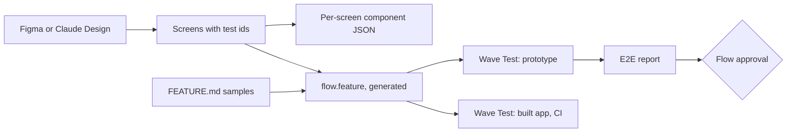

# End-to-end tests

Wave tests a feature's behaviour the way a person uses it: it opens the entry
screen, fills it in, clicks through, and checks it arrives where the design
says. The same tests run against the prototype while the design is reviewed,
and against the built app once engineers build it, because both carry the same
test ids.

Visual QA of the built app (pixel comparison with the approved screens) is a
separate, later piece; this page is about behaviour.

## How it fits



- **Test ids** go on every screen, section and design-system component when the
  screens are published.
- **The component JSON**, one per screen, lists them as a tree.
- **The Gherkin** (`flow.feature`) is generated from the flow: the happy path,
  from the entry screen to the last.
- **Wave Test**, a skill, runs it. People ask Claude ("test the lead
  qualification prototype"); Claude runs the commands and publishes the report.
- **A flow is approved only when its latest run passed** on the versions being
  approved.

## Test ids

`<screen>.<sections>.<design-system id>.<slug>`, on the element as
`data-testid`:

```
about-you.form.DS.textField.full-name
about-you.form.DS.chip.founder-ceo
about-you.form.DS.button.continue
budget-timing.form.DS.select.company-size
budget-timing.form.DS.segmentItem.eur
```

| Part | Comes from | Notes |
| --- | --- | --- |
| Screen | The Figma frame's name, as a slug (Figma flow); the screen's slug in FEATURE.md (Claude Design flow) | The gate refuses a frame whose name is not a screen name (a name with a number, a size and separators in it fails; `About you` passes) |
| Sections | Every named landmark between the screen and the element: form, header, footer, nav, main, aside, dialog, or a section with a name | Named from the layer (or `data-wave-slug`), else the landmark's own kind (`form`, `header`). Usually one level; two for a form in a dialog |
| Design-system id | The component's id in the design system, as written there (`DS.button`, `DS.segmentItem`) | The component's, not the variant's: switching Primary to Secondary renames nothing |
| Slug | The element's label as drawn ("Continue", "EUR"), else its field's name | Fixed once given |

The screen's root element carries the screen alone (`budget-timing`), and each
section its own path (`budget-timing.form`); "I am on the budget-timing screen"
checks the root.

**Stable.** A test id is given once and never changed: it is carried across
versions with the element's Wave id (`ids --from`), and frozen when the flow is
approved. Renaming a label later does not rename its test id.

**Checked.** Preflight refuses a screen with a missing or duplicate test id, or
one that does not start with its screen. Two controls with the same label in
the same section (two "Edit" buttons) are a duplicate: the design names them
apart.

**The same in the app.** The handover carries every test id; Wave Build puts
each on the element that builds it, as `data-testid`.

## The component JSON

One JSON page per screen, `tests/<screen>-components`, shown in Post-it as a
tree. Its levels are the test id's parts:

```json
{
  "testId": "budget-timing",
  "kind": "screen",
  "children": [
    {
      "testId": "budget-timing.form",
      "kind": "section",
      "children": [
        {
          "testId": "budget-timing.form.DS.select.company-size",
          "kind": "component",
          "component": "Select",
          "ds": "DS.select",
          "variant": "default",
          "field": "lead/companySize",
          "options": ["1–10 people", "11–50 people", "51–200 people", "200+ people"],
          "figma": "28:1221",
          "waveId": "n_h193u37q"
        }
      ]
    }
  ]
}
```

## The Gherkin

`tests/flow-feature`, one per feature, generated when the feature is
published. It covers the **happy path**: from the screen nothing leads to,
every required field filled with its sample value, each forward action, each
destination, to the last screen.

```gherkin
Feature: Lead qualification

  Scenario: Happy path
    Given I open the "about-you" screen
    When I fill "about-you.form.DS.textField.full-name" with "Ada Lovelace"
    And I choose "about-you.form.DS.chip.founder-ceo"
    And I click "about-you.form.DS.button.continue"
    Then I am on the "your-project" screen
```

- **Samples.** Every field the happy path fills has a `sample` in FEATURE.md,
  which the engineer confirms in the FEATURE.md interview. Wave never invents
  one: a field without a sample leaves the scenario incomplete, and publishing
  says which.
- **Reviewed with the prototype.** The designer reads it next to the
  prototype; the engineer may add scenarios or steps in the interview.
- **Approved and frozen with the flow.** It is a member of the approval, like
  the screens.

### Steps

A fixed vocabulary. Every step names an element by test id; the same steps run
the prototype and the app.

| Step | Does |
| --- | --- |
| `Given I open the "<screen>" screen` | Prototype: plays that screen. App: opens its route (FEATURE.md) |
| `When I click "<test id>"` | Clicks it |
| `When I fill "<test id>" with "<text>"` | Types into the field inside it |
| `When I choose "<test id>"` | Picks a chip, radio, checkbox, card or segment |
| `When I pick "<option>" in "<test id>"` | Opens a select and picks the option |
| `Then I am on the "<screen>" screen` | The screen's root is on the page |
| `Then "<test id>" shows "<text>"` | Its text contains the words |
| `Then "<test id>" is chosen` | A choice is selected |
| `Then "<test id>" is visible` / `is hidden` | |

## Running: the Wave Test skill

`skills/engineering/wave-test`. Ask Claude: "test `<feature>`'s prototype" or
"run `<feature>`'s Wave tests against `<url>`". Claude:

1. Reads the approved (or current) `flow.feature` and the screens from the host.
2. Runs it with `wave-test`, Wave's runner (Playwright, Chromium), on the
   engineer's machine: against the prototype (the screens played by the
   prototype runtime, as the viewer plays them), or against the app at a URL.
3. Publishes the **E2E report** (`tests/e2e-report`): each step, pass or fail,
   the failing test id and a screenshot.
4. Records the run with the host (`wave_record_test_run`): which versions it
   ran, passed or not.
5. Explains each failure in plain words. A look or a link missing in Figma goes
   in the readiness report for the designer; an answer missing in FEATURE.md
   goes to the engineer. Claude never edits a page or a step to make it pass.

No test code is generated or stored: the Gherkin runs directly on Wave's step
library, so there is nothing to keep in step with it. In the app repo, CI runs
the same Gherkin with the same runner: `node wave-test.mjs run --feature <id>
--target <address>`, with `POSTIT_MCP_URL` and `POSTIT_TOKEN` (an MCP token
pinned to the feature's space, kept as a CI secret). No new endpoint: the host's
MCP tokens already authenticate it.

**The handover check.** `wave-test ids --target <address>` opens each screen's
route in the built app and lists every test id the approved screens carry
that the page does not. Ids the design shows only on a condition (a field that
appears for "Other", an error message) are listed apart.

**Where things live.** The Gherkin, the component JSON and the reports are
pages in the feature's `tests/` folder. The runs are rows in
`wave_test_runs`. The runner is `wave-test.mjs`, served by the host at
`/wave/wave-test.mjs`.

## Approval

`approve_flow` refuses unless the flow's latest recorded run **passed**, on the
current version of every screen and of `flow.feature`. Any change to either
makes the run stale; run Wave Test again.

## Plan

| Phase | What | Status |
| --- | --- | --- |
| 1 | Test ids (assigned at publish, carried, checked in preflight), per-screen component JSON, the gate's screen-name rule | Shipped |
| 2 | `sample` in FEATURE.md, Gherkin generation at publish and FEATURE.md save, the Gherkin approved with the flow | Shipped |
| 3 | `@wave/test` (step library, runner, prototype and app targets), the Wave Test skill, the E2E report, runs recorded, approval refused without a passing run | Shipped |
| 4 | Handover carries test ids, the component JSON and the Gherkin; Wave Build sets `data-testid`; `wave-test ids` (the handover check); CI runs with an MCP token | Shipped |

## Decisions

- Test id parts: screen from Figma's frame name, sections from named
  landmarks, the design system's own ids (`DS.button`), the drawn label as
  slug.
- Gherkin is generated, reviewed with the prototype, approved and frozen with
  the flow; happy path first.
- No generated test code: the Gherkin runs on a fixed step library.
- Tests run on the engineer's machine through the Wave Test skill; results go
  to the host.
- A failing or stale run stops approval.
- Both flows (Figma and Claude Design) get the same test ids, JSON and Gherkin,
  made by Wave's server at publish.
